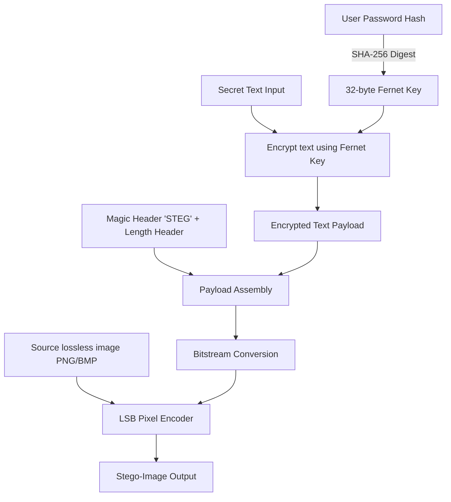

# SteganoSecure: Secure Flask Steganography Web Application

SteganoSecure is a Flask-based web application that combines symmetric cryptography and Least Significant Bit (LSB) image steganography. Users can securely encrypt secret text, hide it within lossless cover images, and safely retrieve it back via decryption.

---

## 🚀 Key Features

*   **Secure Authentication**: User registration and login system with passwords stored safely as hashes using PBKDF2/SHA256 (via [app.py](file:///c:/Users/Raheel/Desktop/6th%20semester/Information%20security/stegano_flask_app/app.py)).
*   **Key Derivation from Hash**: Leverages the user's password hash to derive a unique 32-byte Fernet (AES-128 in CBC mode with HMAC-SHA256) encryption key. Only the exact user who encrypted the secret can decode and decrypt it.
*   **LSB Steganography**: Embeds the encrypted bitstream directly into the Least Significant Bits of the RGB channels of cover images.
*   **Lossless Compression Support**: Strictly allows `.png` and `.bmp` formats to prevent compression artifacts from corrupting the hidden payload.
*   **Tamper Protection**: Embeds a signature header (`STEG`) and a payload length prefix, preventing decryption of corrupted, altered, or non-stego images.
*   **Modern Web UI**: Built with a clean layout containing grid menus, authentication views, and real-time status alerts (styled in [style.css](file:///c:/Users/Raheel/Desktop/6th%20semester/Information%20security/stegano_flask_app/static/style.css)).

---

## 🔒 Cryptographic & Steganographic Architecture

The dual-layered security mechanism operates as follows:



### 1. Symmetric Encryption
When you input secret text:
1. The app fetches the user's unique `password_hash` from the SQLite database.
2. A `SHA-256` hash of this string is computed, producing a 32-byte digest that is base64-encoded to form a valid key for the `Fernet` cryptosystem.
3. The plaintext is encrypted using this key.

### 2. LSB Encoding
1. The message payload is constructed as: `b'STEG'` (4-byte Magic signature) + `length` (4-byte big-endian integer representing payload length) + `encrypted_bytes`.
2. The payload is converted into an array of bits.
3. The cover image is traversed pixel-by-pixel. For each pixel, the LSB of the Red, Green, and Blue channels is updated with the message bits.
4. The output is saved to the `outputs/` folder in a lossless format.

### 3. LSB Decoding
1. The stego-image is uploaded.
2. The LSBs of the image's pixels are read sequentially to locate the signature `b'STEG'`.
3. The next 4 bytes are read to determine the exact payload length.
4. The payload bits are collected and decoded back to bytes.
5. The ciphertext is decrypted using the logged-in user's password-derived key. If a different user attempts to decode it, the key derivation yields an incorrect key, raising an `InvalidToken` exception and preventing access.

---

## 📂 Project Structure

*   [app.py](file:///c:/Users/Raheel/Desktop/6th%20semester/Information%20security/stegano_flask_app/app.py): The primary Flask application implementing database connection, key derivation, LSB bitwise operations, route endpoints, and request handling.
*   [static/style.css](file:///c:/Users/Raheel/Desktop/6th%20semester/Information%20security/stegano_flask_app/static/style.css): Global styling file containing form and dashboard layouts.
*   [templates/](file:///c:/Users/Raheel/Desktop/6th%20semester/Information%20security/stegano_flask_app/templates): Jinja2 HTML templates:
    *   [base.html](file:///c:/Users/Raheel/Desktop/6th%20semester/Information%20security/stegano_flask_app/templates/base.html): Common layout page with navigation links and alert messages.
    *   [register.html](file:///c:/Users/Raheel/Desktop/6th%20semester/Information%20security/stegano_flask_app/templates/register.html) / [login.html](file:///c:/Users/Raheel/Desktop/6th%20semester/Information%20security/stegano_flask_app/templates/login.html): Authentication forms.
    *   [dashboard.html](file:///c:/Users/Raheel/Desktop/6th%20semester/Information%20security/stegano_flask_app/templates/dashboard.html): Dashboard with tabbed modules for encoding and decoding files.
    *   [result.html](file:///c:/Users/Raheel/Desktop/6th%20semester/Information%20security/stegano_flask_app/templates/result.html): Download panel for generated stego-images.
    *   [decoded.html](file:///c:/Users/Raheel/Desktop/6th%20semester/Information%20security/stegano_flask_app/templates/decoded.html): Screen displaying the decrypted message.
*   `users.db`: SQLite database storing user authentication tables (created dynamically upon startup).
*   `uploads/` / `outputs/`: Working folders storing source and stego-images (created dynamically).

---

## 🛠 Installation & Setup

### Prerequisites
Make sure you have **Python 3.8 or newer** installed.

### 1. Clone & Navigate to Project Directory
```bash
cd "c:\Users\Raheel\Desktop\6th semester\Information security\stegano_flask_app"
```

### 2. Create & Activate Virtual Environment
**Windows:**
```bash
python -m venv venv
venv\Scripts\activate
```

**macOS/Linux:**
```bash
python3 -m venv venv
source venv/bin/activate
```

### 3. Install Dependencies
Install the required packages directly:
```bash
pip install Flask Pillow cryptography
```

### 4. Launch the App
```bash
python app.py
```

Open your browser and navigate to `http://127.0.0.1:5000` to start using the app.

---

## ⚠️ Important Security & Usage Rules

1.  **Strict Image Formats**: Use `.png` or `.bmp` files. Do not upload `.jpg` or `.jpeg` files. JPEG compression uses lossy transformations (Discrete Cosine Transform) which discard "less important" color data, destroying the exact LSB bit adjustments and corrupting the hidden payload.
2.  **Size Limitations**: The payload size (in bits) must not exceed the total bit capacity of the image:
    $$\text{Max Payload Size (bits)} = \text{Width} \times \text{Height} \times 3$$
3.  **Account Lock**: Because encryption keys are derived from the user's password hash, messages can only be decrypted when logged in as the specific user account that encoded them. Changing a password in the database will invalidate access to previously encrypted stego-images.
